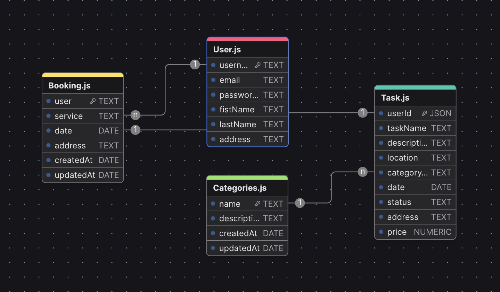
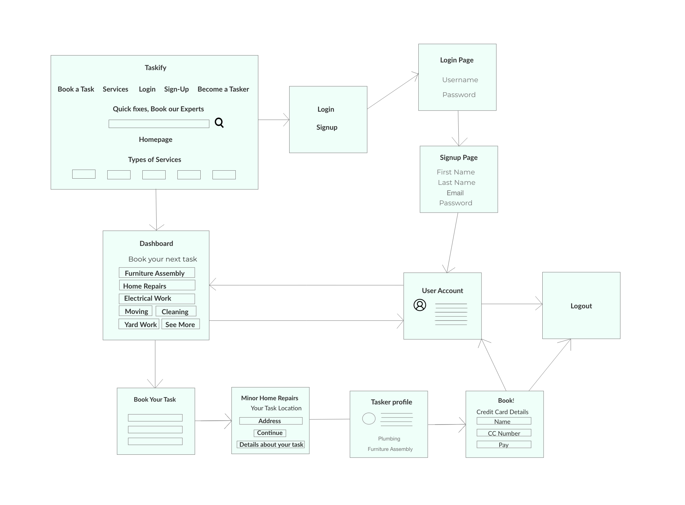

# Taskify

## Description

Taskify is a comprehensive task management application designed to help users organize and book various tasks efficiently. The app offers functionalities to book home repairs, yard work, painting, cleaning, junk removal, and more. Taskify was built to address the need for a user-friendly platform where users can easily manage and delegate tasks, ensuring a seamless and stress-free experience.

## Getting Started

- **Deployed App**: [Render]()

## Installation Instructions

### Backend

1. **Clone the repository**:
   git clone https://github.com/AlejandraValdivia/taskify-back-end
   cd taskify-back-end

2. **Install dependencies**:
   `npm install`

3. **Start the server**:
   `node server.js`

## ERM (Entity Relationship Diagram)

- **Back-End Repository**: [Taskify Backend Repo](https://github.com/AlejandraValdivia/taskify-back-end)

## Attributions

- **React**: [React](https://reactjs.org/)
- **Bootstrap**: [Bootstrap](https://getbootstrap.com/)
- **MongoDB**: [MongoDB](https://www.mongodb.com/)
- **Express**: [Express](https://expressjs.com/)
- **Node.js**: [Node.js](https://nodejs.org/)
- **JWT**: [jsonwebtoken](https://github.com/auth0/node-jsonwebtoken)

## Technologies Used

- **Frontend**: React, Bootstrap, Axios
- **Backend**: Node.js, Express, MongoDB, Mongoose
- **Authentication**: JWT (JSON Web Tokens)
- **Deployment**: Render, Netlify
- **Version Control**: Git, GitHub

## Next Steps

- **User Notifications**: Implement real-time notifications for task updates and reminders.
- **Payment Integration**: Integrate payment gateways for task bookings.
- **User Profiles**: Enhance user profiles with more customization options.
- **Mobile App**: Develop a mobile version of Taskify for both iOS and Android.

---

# Taskify Backend

This repository contains the frontend services for Taskify. For more details on the project, please visit the [https://github.com/AlejandraValdivia/taskify-front-end]().
